# Swappy  

<< BRIEF DESCRIPTION OF THE PROJECT >>

---
# Team Members
| Name and Surname | Email | GitHub |
|:-----------------|:-----:|-------:|
| **Jaime Ochoa**    | j.ochoa.2022@alumnos.urjc.es | GranLobo2004 |
| **David Pimentel** | d.pimentel.2021@alumnos.urjc.es | daaaviid-03 |
| **Lídia Budiós**   |  l.budios.2024@alumnos.urjc.es | lidiabm |

---
# Functionalities 

<< TRANSFORM INTO REQUIREMENTS >>

Our web application is designed to facilitate buying and selling products, offering an intuitive, modern, and efficient experience for both buyers and sellers. Below are the main features it provides.  

The application allows users to explore a wide variety of products across different categories: new, reconditioned, and second-hand. Additionally, a search function and advanced filters are available to refine searches based on user preferences, making it easier to find the ideal product.  

Users can list items on the platform by providing images, name, price, description, stock, discounts, filter tags, and specifying whether the product is new, reconditioned, or second-hand. They can also modify the details of the products they have listed for sale.  

A shopping cart feature is available, allowing users to add products to manage their selected items easily or remove them before proceeding to checkout. During the checkout process, the necessary purchase information is requested, and once completed, the user receives a confirmation message ensuring the transaction was successful.  

Each user has a personal profile where they can view and manage their information. From this section, users can edit their profile to update personal details, access the option to sell a new product, or navigate to the privacy section.  

Buyers can rate and leave reviews on products, helping other users make informed decisions. Reviews include a title, a description of the opinion, and a star rating (1 to 5).

---

# Project Structure
## Database Design
### Entities 

<< Explicar que existen los tipos con sus responsabilidades correctas pero indicar que ahora solo se puede ser admin debido al estado alpha de la aplicación web >>

- **User**: there are three types of users: *anonymous*, *registered* and *administrator*. 
    - The *registered* user can place multiple orders, leave multiple reviews and add products to the cart 
    - The *admin* user can manage the products, the reviews and the orders 
    - The *anonymous* user Anonymous user can only see the products, but has no relation with the other entities
Therefore it is related to the entities: product, review and order.

- **Product**: represents the products available in the application. There are thre types of producs: *new*, *reconditioned* and *second-hand*. << Both types of products have images of themselves, can have user reviews, and can be part of orders with the difference that first-hand products can be in multiple orders and second-hand products can only be in one. (esta raro)>>
Therefore it is related to the entities: user, review and order. 

- **Review**: a review is created by a user and is associated with a product. 
Therefore it is related to the entities: user and product.

- **Order**: an order belongs to a user and is made up of multiple products. 
Therefore it is related to the entities: user and product.

- **Image**: linked to products and users; each product can have multiple images.
Therefore it is related to the product entity as well as to the user. 

### Database Diagram 
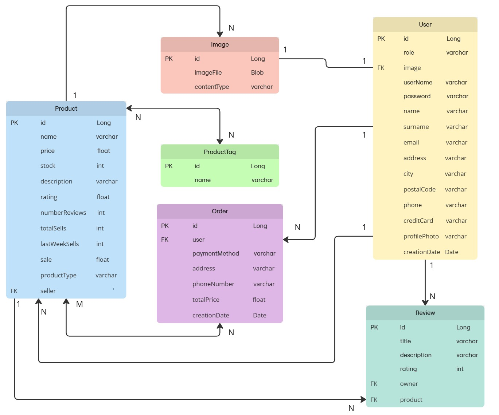

## Class Diagram 

<< Breve descripcion e introduccion al MVC>>

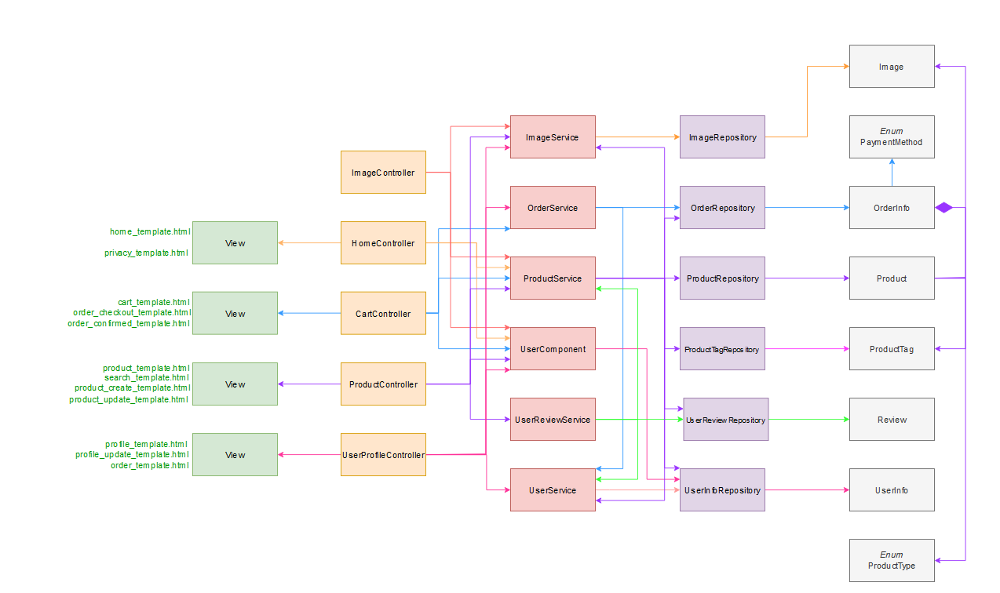

## User Permissions 
In this first installment of the practice, the user will always be an administrator and will be able to use all the functionalities of the web application.

## Images 
<< At this fase of the project, the images will be related either to a product or a user. A product will be related to at least 1 image, while the user may or may not be linked to an image. (incorrecto)>>

# Navigation 
The web application we have developed is an online buying and selling platform. Users can both list products for sale and purchase new, refurbished, or second-hand items.

Most screens of the application have a main menu at the top of the screen, consisting of six main sections:

## 1. Home

The web application starts its execution on the main screen, called Home. In this section, featured products are displayed, organized into different categories, such as bestsellers or discounted items, making navigation easier for users and helping them find what they are looking for intuitively.

Additionally, the platform includes a search function that allows users to quickly and efficiently locate specific products.

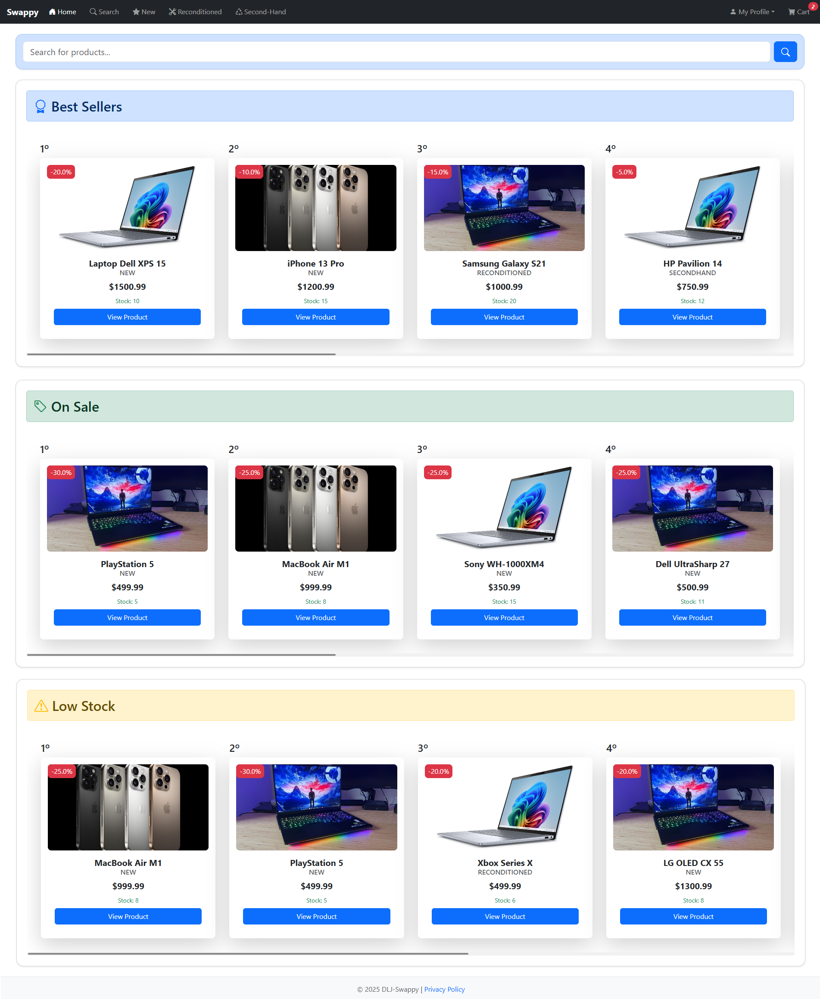

## 1.1. Product details

On this screen, the user can view all the details of the product, including: the product name and type, price and any applicable discounts, a detailed description of the item, the average rating and total number of reviews, the available stock quantity, and the number of sales made.

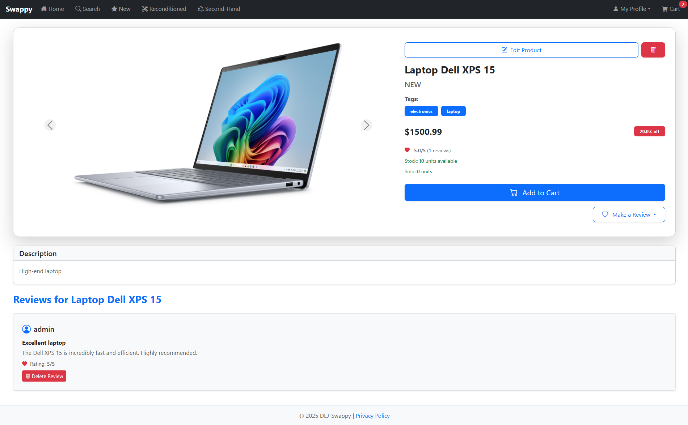

Additionally, from this same section, users can leave comments and ratings on the product, as well as read the opinions and reviews of other buyers.

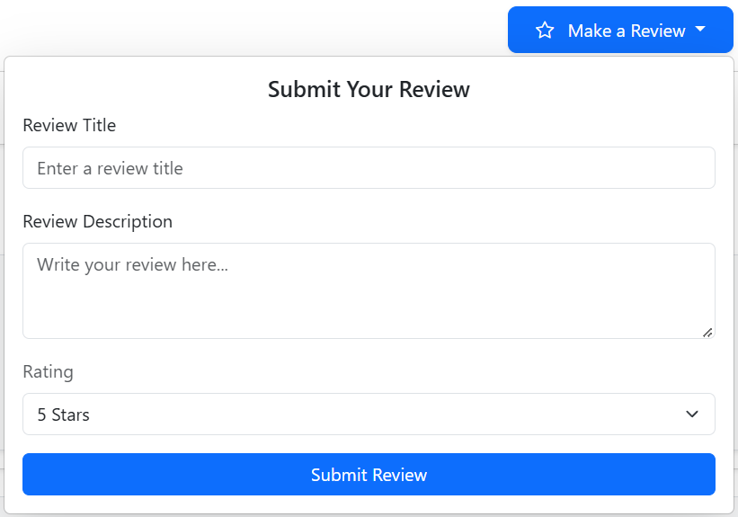

## 2. Search

On this screen, all types of items will be displayed to the user, who can narrow down their search using various available filters, such as category, price, rating, among others. They will also have the option to perform a direct search by entering keywords, as shown below:

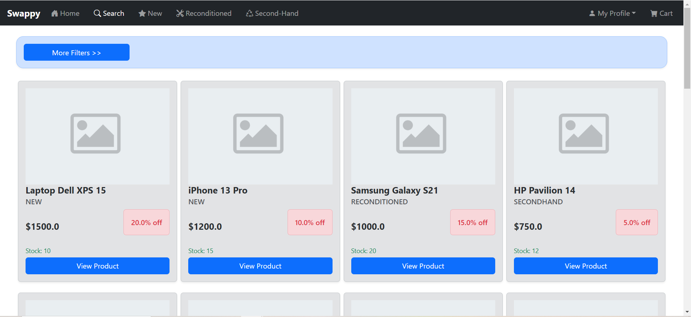

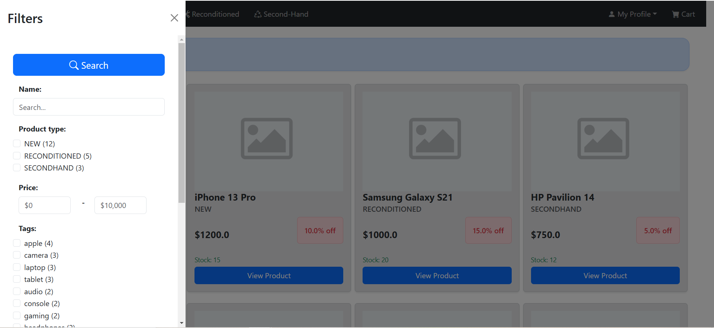
<<
## 3. New

This screen displays all the new products available on the website. Additionally, it features a search function and filters that allow users to easily find the product they want, tailoring the search to their preferences.

## 4. Reaconditioned

Similar to the previous screen, this one displays all the reaconditioned products available on the website. It also includes filters and a search function so that the user can refine their search and easily find the desired product.

## 5. Second-Hand

This screen is similar to the previous two, but instead of displaying new or reaconditioned products, it shows second-hand products available on the website. As with the previous screens, the user can use filters and a search function to find the specific product they are looking for.

(reformular para que indique que aplica filtros y busqueda)>>

<< ## 6. My Profile

This button provides access to a dropdown menu that contains several sections related to the user's profile. The available sections are: View Profile, Edit Profile, Sell New Product, and Privacy. (innecesario)>>

## 6.1. View Profile

On this screen, the user can view all their personal information, including their full name, username, profile picture, email, location, and phone number.

Additionally, this section displays the user's comments and ratings, purchase orders, and all the products they have listed for sale.

From this screen, the user can also directly access Edit Profile to update their personal information and Sell New Product to list a new product for sale.

## 6.1.1. Order Detailed

<< COMPLETE THIS PART >>

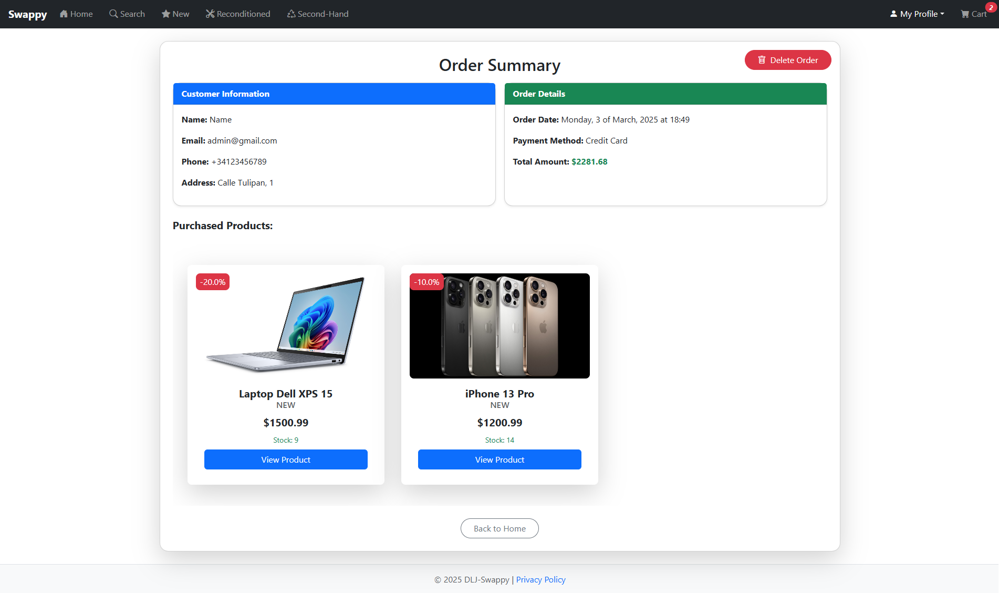

## 6.2. Edit Profile

On this screen, the user can edit all fields of their personal information, including the profile image, name, username, last name, email, phone number, address, city, postal code, and payment method. Once the changes are made, they can either save them or cancel the edit if they do not wish to apply the modifications.

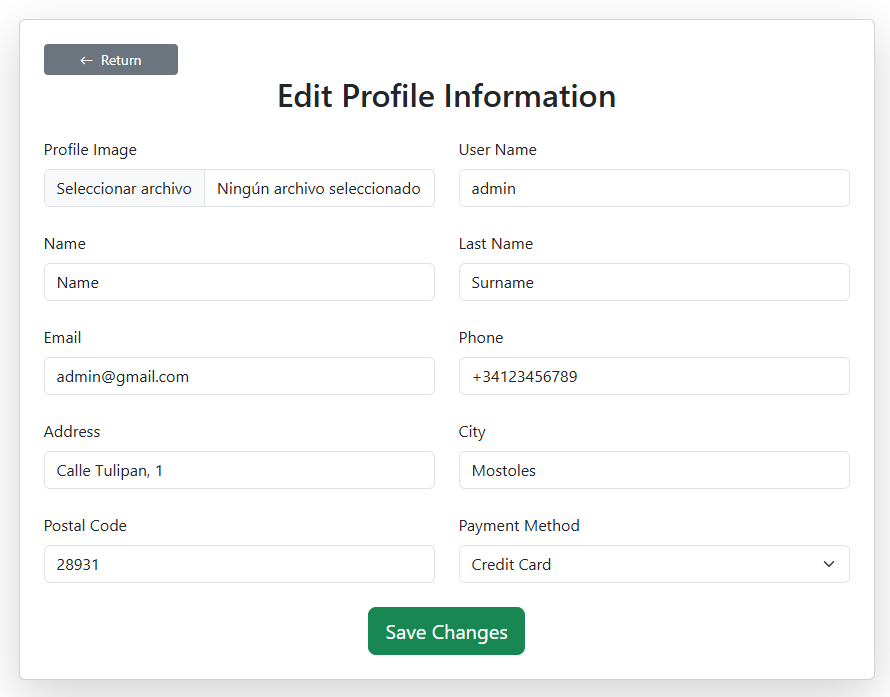

## 6.3. Sell New Product

On this screen, the user can add a new item for sale so that other users can purchase it. To list the product, they must provide the following information: product images, product name, price, detailed description, stock quantity, discount (if applicable), tags to facilitate search through filters, and the product condition: new, second-hand, or reaconditioned.  

Once this information is completed, the user can publish the product on the platform.

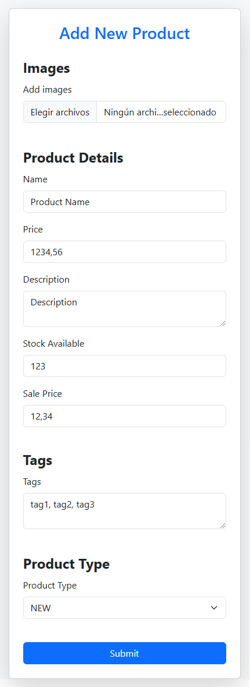

## 6.4. Privacy

This screen explains to the user the terms of the license under which the application is distributed.

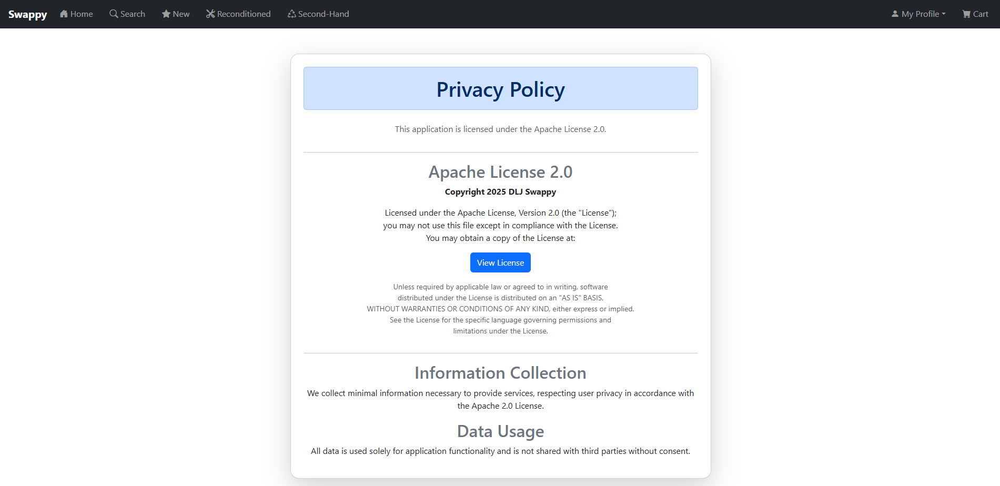

## 7. Cart

The cart section, where the user can add products they are interested in or remove those they no longer want. Once they have selected the items, they can proceed to the payment process by clicking the "Checkout" button.

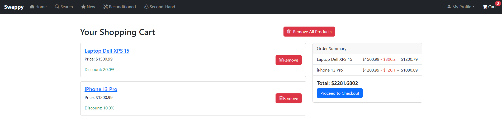

## 7.1. Checkout

In the Checkout process, the user is asked for the necessary information to complete the purchase, such as the payment method, shipping address, and phone number. 

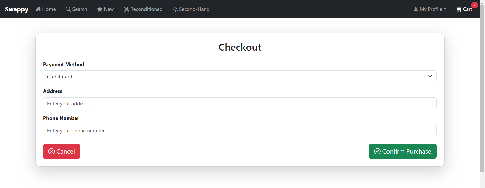

Once the user makes the payment, they receive a notification confirming that the transaction has been successfully completed, along with the order ID for reference.

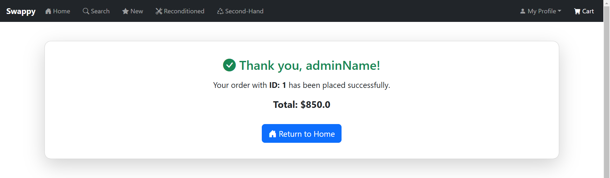 

## 8. Error Page

<< COMPLETE THIS PART >>

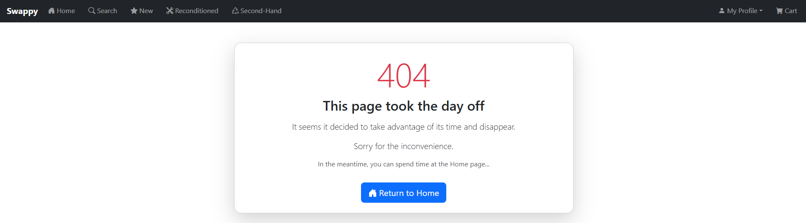

---
# Development environment configuration

First of all, in order to run the project you will need to download and install the following applications:

- [Docker](https://www.docker.com/)
  
- [Java Development Kit 21 (JDK21)](https://www.oracle.com/java/technologies/downloads/#java21)
  
- [Visual Studio Code](https://code.visualstudio.com/Download) or [IntelliJ IDEA](https://www.jetbrains.com/idea/download/)

After installing the applications you will open Docker as well as Visual Studio or IntelliJ. In case of using Visual Studio, it will be necessary to go to the Extensions section and install the "Spring Boot Extension Pack" extension. Once the applications are running, you will open the terminal inside Visual Studio or Intellij and run the following command in order to clone the GitHub repository.

"git clone https://github.com/SSDD-2025/practica-sistemas-distribuidos-2025-grupo-6.git"

The next step is to enter the next command in Docker's terminal.

"docker run --rm -e MYSQL_ROOT_PASSWORD=Password -e MYSQL_DATABASE=onlinestore -p 3306:3306 -d mysql:8.0"

As a result of running the command you will observe that docker will start downloading. You will have to wait until you see the new container in the Container's section of Docker, its image field should be "mysql:8.0".

After the container is running you can go back to IntelliJ or Visual Studio and locate the "Application.java" file. Once located, run the file inside IntelliJ or Visual Studio, the play button on the top left side. Afterwards open you computer's Internet browser and enter this URL "http://localhost:8080", it will lead you directly to the website application.

In order to close the project you will need to press CTR + c in Visual Studio or IntelliJ and press the stop button near the container in Docker.

# Team Contributions 

## David Pimentel

### Summary of Contributions
I have worked on the main menu, advanced search, shopping cart and image service. Additionally, I have contributed styling using Bootstrap to various HTML pages of the project and the logic of deletions. I have also assisted other team members with certain functionalities, styles, and have been responsible for the general code refactoring.

### Main commits in the repository

- [UserComponent, Integration products in home page, product service and user service](https://github.com/SSDD-2025/practica-sistemas-distribuidos-2025-grupo-6/commit/08a1a17b0e2bf16caae4ad42ca026fdbc1b0e30f)

- [Refactor templates to use layout system and remove unused files, starting to implement advanced search for products](https://github.com/SSDD-2025/practica-sistemas-distribuidos-2025-grupo-6/commit/1989bedd22da834bafa3e0ca11830c39a25ba061)

- [Order processing features: order repository, cart template, checkout template, and confirmation page. Update product filtering and search functionality.](https://github.com/SSDD-2025/practica-sistemas-distribuidos-2025-grupo-6/commit/1761f07a3188a0cd48668366edd26719b4ab4824)

- [Refactoring cart controller, home controller, and serch part in product controller, and some html](https://github.com/SSDD-2025/practica-sistemas-distribuidos-2025-grupo-6/commit/ec79b3aa94f53ade89d234c28a3dbca089100e17)

- [Deletions first implementation, reconfiguration Review relation with product, all dependencies of the changes](https://github.com/SSDD-2025/practica-sistemas-distribuidos-2025-grupo-6/commit/78e45a8a97510f9835c7c46e9c05225e1d456a41)

### Main files modified

- [OrderInfo.java](src/main/java/es/dlj/onlinestore/model/OrderInfo.java)

- [ProductController.java](src/main/java/es/dlj/onlinestore/controller/ProductController.java)

- [ProductService.java](src/main/java/es/dlj/onlinestore/service/ProductService.java)

- [CartController.java](src/main/java/es/dlj/onlinestore/controller/CartController.java)

- [ImageService.java](src/main/java/es/dlj/onlinestore/service/ImageService.java)

## Jaime Ochoa de Alda

### Sumary of contributions
I have placed most of my efforts in the product's detail page product form and service. The mayority of my work has been on functionalities concerning the product entity such as editing and creating products. Furthermore, I have also worked in the image entity by adding the functionality to load images from a dynamic database and save images in the database. Stablishing entities database's relationships has been as well part of my labour.

### Main commits in the repository

- [creation of RawProduct class and new savingProduct method](https://github.com/SSDD-2025/practica-sistemas-distribuidos-2025-grupo-6/commit/57b95b4c65b6d02dbec7d53a7ca47460cd6ed275)
  
- [Adjusting new product process for second hand products](https://github.com/SSDD-2025/practica-sistemas-distribuidos-2025-grupo-6/commit/3242b2d61aed4b68da8449385110dd5cd07e4a30)
  
- [updating newProduct and updateProduct functions](https://github.com/SSDD-2025/practica-sistemas-distribuidos-2025-grupo-6/commit/07228bf5e02b21aa3bc676b5b350144520108eae)
  
- [Loading product images](https://github.com/SSDD-2025/practica-sistemas-distribuidos-2025-grupo-6/commit/427b611b25d70edf0aae00a55be3855671d37076)
  
- [Image entity and cleaning unused imports in home controller](https://github.com/SSDD-2025/practica-sistemas-distribuidos-2025-grupo-6/commit/85b3b8d62c17ff6646ee4080683e3829170abd2d)

### Main files modified
- [ProductService.java](src/main/java/es/dlj/onlinestore/service/ProductService.java)
  
- [ProductController.java](src/main/java/es/dlj/onlinestore/controller/ProductController.java)
  
- [ImageController.java](src/main/java/es/dlj/onlinestore/controller/ImageController.java)
  
- [ImageService.java](src/main/java/es/dlj/onlinestore/service/ImageService.java)

- [Image.java](src/main/java/es/dlj/onlinestore/model/Image.java)

## Lídia Budiós Martin

### Sumary of contributions
I have focused on the user profile section, developing a screen where all user data is displayed and another one that allows editing it. Additionally, I have implemented the functionality for users to leave reviews on various products in the application, including a section to display all ratings, both for each product and in the user profile. Lastly, I have contributed to the design of the application's different screens and have written a large part of the README.

### Main commits in the repository

- [a menu has been added to be able to rate a product and when you add it it is saved in the database, but it is not shown in the profile](https://github.com/SSDD-2025/practica-sistemas-distribuidos-2025-grupo-6/commit/ee6ebda7b2b09bab3a4c5a5fddb9f2e251d1c3b4)
  
- [added user profile screen](https://github.com/SSDD-2025/practica-sistemas-distribuidos-2025-grupo-6/commit/5b298ce39cb5af6812c74d351479fbe11fe3c454)
  
- [change user data functionality added](https://github.com/SSDD-2025/practica-sistemas-distribuidos-2025-grupo-6/commit/83219a51704bd4c82d2e510258a0913ac1ab5462)
  
- [added the averages of the rating and the number of evaluations](https://github.com/SSDD-2025/practica-sistemas-distribuidos-2025-grupo-6/commit/6b4cbd297edfdcaf40aa3dd6593a471375c3967c)
  
- [user reviews class added](https://github.com/SSDD-2025/practica-sistemas-distribuidos-2025-grupo-6/commit/da803d783e9042aa4e013751c16020c30d4e75fe)

### Main files modified
- [UserReviewService.java](src/main/java/es/dlj/onlinestore/service/UserReviewService.java)
  
- [UserProfileController.java](src/main/java/es/dlj/onlinestore/controller/UserProfileController.java)
  
- [UserService.java](src/main/java/es/dlj/onlinestore/service/UserService.java)
  
- [Review.java](src/main/java/es/dlj/onlinestore/model/Review.java)

- [UserInfo.java](src/main/java/es/dlj/onlinestore/model/UserInfo.java)
