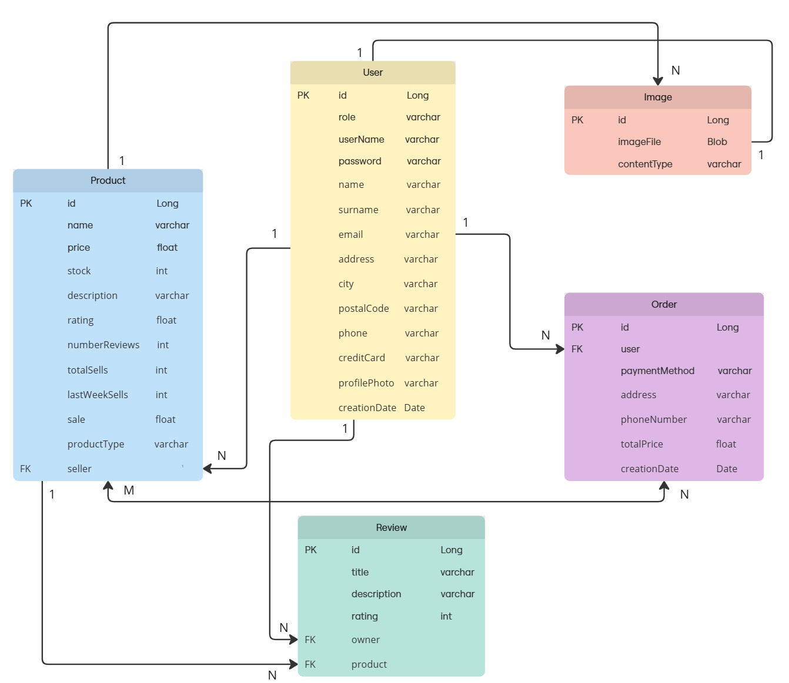

# Swappy  

## Team Members
| Name and Surname | Email | GitHub |
|:-----------------|:-----:|-------:|
| **Jaime Ochoa**    | j.ochoa.2022@alumnos.urjc.es | GranLobo2004 |
| **David Pimentel** | d.pimentel.2021@alumnos.urjc.es | daaaviid-03 |
| **Lídia Budiós**   |  l.budios.2024@alumnos.urjc.es | lidiabm |

---

## Aplication Overview
### Entities 
- **User**: there are three types of user: anonymous, registered and administrator. 
    - The *registered user* can place multiple orders, leave multiple reviews and add products to the cart 
    - The *admin user* can manage the products, the reviews and the orders 
    - The *anonymous user* Anonymous user can only see the products, but has no relation with the other entities
Therefore it is related to the entities: product, review and order.

- **Product**: represents the products available in the application.There are two types of producs: *first-hand* and *second-hand*. Both types of products have images of themselves, can have user reviews, and can be part of orders with the difference that first-hand products can be in multiple orders and second-hand products can only be in one.
Therefore it is related to the entities: user, review and order. 

- **Review**: a review is created by a user and is associated with a product. 
Therefore it is related to the entities: user and product.

- **Order**: an order belongs to a user and is made up of multiple products. 
Therefore it is related to the entities: user and product.

- **Image**: linked to products; each product can have multiple images.
Therefore it is related to the product entity. 

#### Database entity diagram 

### User Permissions 
<!-- do you think the permissions explained in the user entity are okay? -->

### Images 

---

## Team Contributions 
<!-- in the end -->
