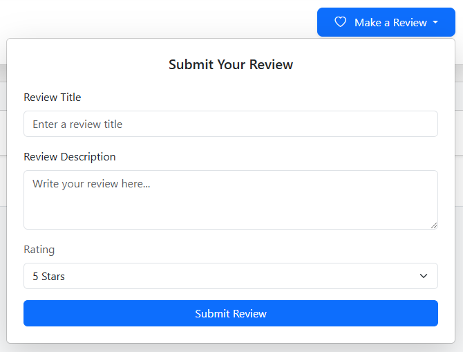
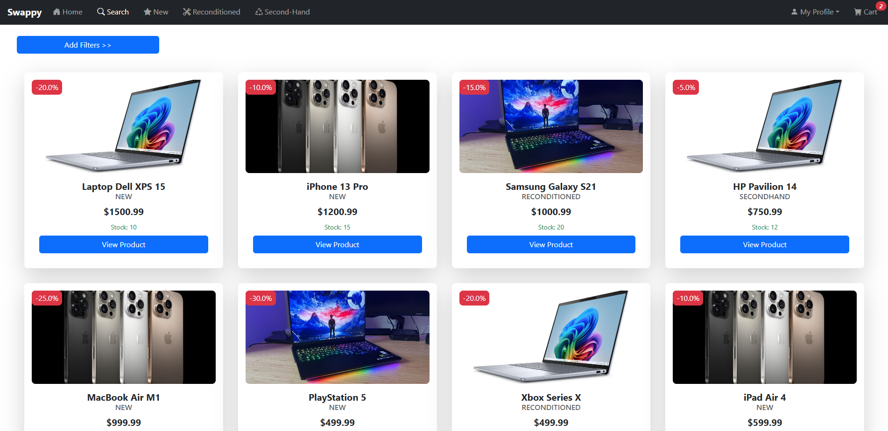
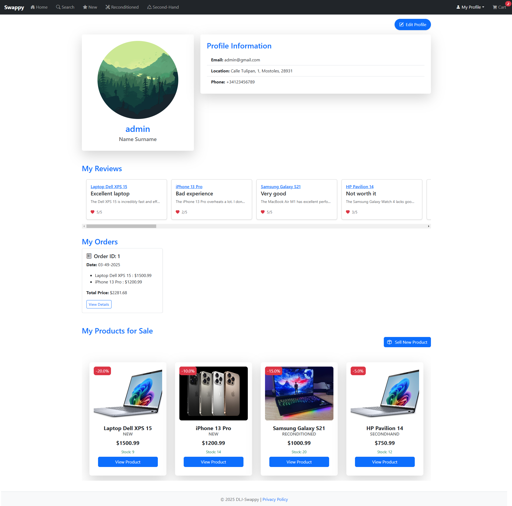

# Swappy  

We have decided to develop a web application for buying and selling products. This application will allow users to both purchase and list all types of items for sale, offering an intuitive, modern, and efficient experience for both buyers and sellers.

---
# Team Members
| Name and Surname | Email | GitHub |
|:-----------------|:-----:|-------:|
| **Jaime Ochoa**    | j.ochoa.2022@alumnos.urjc.es | GranLobo2004 |
| **David Pimentel** | d.pimentel.2021@alumnos.urjc.es | daaaviid-03 |
| **Lídia Budiós**   |  l.budios.2024@alumnos.urjc.es | lidiabm |

---
# Methodologies used
To coordinate our team, we have been using Trello: 
[Link to Trello commit](https://github.com/SSDD-2025/practica-sistemas-distribuidos-2025-grupo-6/commit/da803d783e9042aa4e013751c16020c30d4e75fe)

# Functionalities 

- Products must belong to one of the following categories: new, reaconditioned, or second-hand.
- The application must allow users to explore products across different categories.
- The application must organize and display products on the home screen according to different sections, such as best sellers, discounted items, and low-stock products.
- Users must be able to search for specific products using a search bar.
- Filters must be provided to allow users to search for products based on their preferences.
- Users must be able to list products for sale by providing images, name, price, description, stock, discounts, and filter tags, and specifying whether the product is new, reaconditioned, or second-hand.
- Users must be able to modify the details of the products they have listed for sale.
- Users must be able to add products to a shopping cart.
- Users must be able to remove products from the cart before completing the purchase.
- The application must request the necessary information to complete the purchase during the checkout process.
- The application must display a confirmation message to the user once the purchase has been completed.
- The application must provide each user with a personal profile where they can view all their data, such as profile picture, name, address, email, phone number, reviews, order history, and products listed for sale.
- Users must be able to edit their profile to update their personal information.
- Users must be able to access the option to sell a product from their profile.
- Users must be able to access a privacy section within their profile.
- Users must be able to rate and leave reviews on products.
- Reviews must include a title, a description, and a rating from 1 to 5.

---

# Project Structure
## Database Design
### Entities 

- **User**: there are three types of users: *anonymous*, *registered* and *administrator*, but at this moment, only one admin user can be used.
    - The *registered* user can place multiple orders, leave multiple reviews and add products to the cart 
    - The *admin* user can manage the products, the reviews and the orders 
    - The *anonymous* user Anonymous user can only see the products, but has no relation with the other entities
Therefore it is related to the entities: product, review and order.

- **Product**: represents the products available in the application. There are thre types of producs: *new*, *reconditioned* and *second-hand*. All types of products have images of themselves, can have user reviews, and can be part of orders with the difference that new products can be in multiple orders and second-hand products can only be in one.
Therefore it is related to the entities: user, review and order. 

- **Product Tag**: a product can have multiple tags, and each tag can be associated with multiple products.

- **Review**: a review is created by a user and is associated with a product. 
Therefore it is related to the entities: user and product.

- **Order**: an order belongs to a user and is made up of multiple products. 
Therefore it is related to the entities: user and product.

- **Image**: linked to products and users; each product can have multiple images.
Therefore it is related to the product entity as well as to the user. 

### Database Diagram 

## Class Diagram 

The image below illustrates the architecture of the web application. The system follows the MVC (Model-View-Controller) pattern, where controllers handle user interactions, services manage business logic, and repositories interact with the data layer. On the left side of the diagram, each view has been represented with its different templates which are used based on the corresponding controller.

## User Permissions 
In this first installment of the practice, the user will always be an administrator and will be able to use all the functionalities of the web application.

## Images 
At this fase of the project, the images will be related either to a product or a user. A product will be related to at least 1 or more images, while the user will have only 1 image related to itself.

# Navigation 
The web application we have developed is an online buying and selling platform. Users can both list products for sale and purchase new, reaconditioned, or second-hand items.

Most screens of the application have a main menu at the top of the screen, consisting of seven main sections:

## 1. Home

The web application starts its execution on the main screen, called Home. In this section, featured products are displayed, organized into different categories, such as bestsellers or discounted items, making navigation easier for users and helping them find what they are looking for intuitively.

Additionally, the platform includes a search function that allows users to quickly and efficiently locate specific products.

## 1.1. Product details

On this screen, the user can view all the details of the product, including: the product name and type, price and any applicable discounts, a detailed description of the item, the average rating and total number of reviews, the available stock quantity, and the number of sales made.

Additionally, from this same section, users can leave comments and ratings on the product, as well as read the opinions and reviews of other buyers.

## 2. Search

On this screen, all types of items will be displayed to the user, who can narrow down their search using various available filters, such as category, price, rating, among others. They will also have the option to perform a direct search by entering keywords, as shown below:

## 3. New, Reaconditioned, Second-Hand

These three screens display all the products from the corresponding category: new, reaconditioned, or second-hand, depending on the section the user accesses. 

Additionally, each one includes a search tool and advanced filters that make it easier to locate the desired product, allowing users to refine their search based on their preferences.

## 4. View Profile

On this screen, the user can view all their personal information, including their full name, username, profile picture, email, location, and phone number.

Additionally, this section displays the user's comments and ratings, purchase orders, and all the products they have listed for sale.

From this screen, the user can also directly access Edit Profile to update their personal information and Sell New Product to list a new product for sale.

## 5. Edit Profile

On this screen, the user can edit all fields of their personal information, including the profile image, name, username, last name, email, phone number, address, city, postal code, and payment method. Once the changes are made, they can either save them or cancel the edit if they do not wish to apply the modifications.

## 6. Order Detailed

This screen displays an order summary, including the buyer's details, the order information such as the date, payment method, and total price, as well as the purchased products.

## 7. Sell New Product

On this screen, the user can add a new item for sale so that other users can purchase it. To list the product, they must provide the following information: product images, product name, price, detailed description, stock quantity, discount (if applicable), tags to facilitate search through filters, and the product condition: new, second-hand, or reaconditioned.  

Once this information is completed, the user can publish the product on the platform.

## 8. Privacy

This screen explains to the user the terms of the license under which the application is distributed.

## 9. Cart

The cart section, where the user can add products they are interested in or remove those they no longer want. Once they have selected the items, they can proceed to the payment process by clicking the "Checkout" button.

## 9.1. Checkout

In the Checkout process, the user is asked for the necessary information to complete the purchase, such as the payment method, shipping address, and phone number. 

Once the user makes the payment, they receive a notification confirming that the transaction has been successfully completed, along with the order ID for reference.

 

## 10. Error Page

The Error Page will show every time an internall error occurrs or the user tries to access a page which does not exist. The page will display a general message and a button to go back to the Home page.

---
# Development environment configuration

First of all, in order to run the project you will need to download and install the following applications:

- [Docker](https://www.docker.com/)
  
- [Java Development Kit 21 (JDK21)](https://www.oracle.com/java/technologies/downloads/#java21)
  
- [Visual Studio Code](https://code.visualstudio.com/Download) or [IntelliJ IDEA](https://www.jetbrains.com/idea/download/)

After installing the applications you will open Docker as well as Visual Studio or IntelliJ. In case of using Visual Studio, it will be necessary to go to the Extensions section and install the "Spring Boot Extension Pack" extension. Once the applications are running, you will open the terminal inside Visual Studio or Intellij and run the following command in order to clone the GitHub repository.

"git clone https://github.com/SSDD-2025/practica-sistemas-distribuidos-2025-grupo-6.git"

The next step is to enter the next command in Docker's terminal.

"docker run --rm -e MYSQL_ROOT_PASSWORD=Password -e MYSQL_DATABASE=onlinestore -p 3306:3306 -d mysql:8.0"

As a result of running the command you will observe that docker will start downloading. You will have to wait until you see the new container in the Container's section of Docker, its image field should be "mysql:8.0".

After the container is running you can go back to IntelliJ or Visual Studio and locate the "Application.java" file. Once located, run the file inside IntelliJ or Visual Studio, the play button on the top left side. Afterwards open you computer's Internet browser and enter this URL "http://localhost:8080", it will lead you directly to the website application.

In order to close the project you will need to press CTR + c in Visual Studio or IntelliJ and press the stop button near the container in Docker.

# Team Contributions 

## David Pimentel

### Summary of Contributions
I have worked on the main menu, advanced search, shopping cart and image service. Additionally, I have contributed styling using Bootstrap to various HTML pages of the project and the logic of deletions. I have also assisted other team members with certain functionalities, styles, and have been responsible for the general code refactoring.

### Main commits in the repository

- [UserComponent, Integration products in home page, product service and user service](https://github.com/SSDD-2025/practica-sistemas-distribuidos-2025-grupo-6/commit/08a1a17b0e2bf16caae4ad42ca026fdbc1b0e30f)

- [Refactor templates to use layout system and remove unused files, starting to implement advanced search for products](https://github.com/SSDD-2025/practica-sistemas-distribuidos-2025-grupo-6/commit/1989bedd22da834bafa3e0ca11830c39a25ba061)

- [Order processing features: order repository, cart template, checkout template, and confirmation page. Update product filtering and search functionality.](https://github.com/SSDD-2025/practica-sistemas-distribuidos-2025-grupo-6/commit/1761f07a3188a0cd48668366edd26719b4ab4824)

- [Refactoring cart controller, home controller, and serch part in product controller, and some html](https://github.com/SSDD-2025/practica-sistemas-distribuidos-2025-grupo-6/commit/ec79b3aa94f53ade89d234c28a3dbca089100e17)

- [Deletions first implementation, reconfiguration Review relation with product, all dependencies of the changes](https://github.com/SSDD-2025/practica-sistemas-distribuidos-2025-grupo-6/commit/78e45a8a97510f9835c7c46e9c05225e1d456a41)

### Main files modified

- [OrderInfo.java](src/main/java/es/dlj/onlinestore/model/OrderInfo.java)

- [ProductController.java](src/main/java/es/dlj/onlinestore/controller/ProductController.java)

- [ProductService.java](src/main/java/es/dlj/onlinestore/service/ProductService.java)

- [CartController.java](src/main/java/es/dlj/onlinestore/controller/CartController.java)

- [ImageService.java](src/main/java/es/dlj/onlinestore/service/ImageService.java)

## Jaime Ochoa de Alda

### Sumary of contributions
I have placed most of my efforts in the product's detail page product form and service. The mayority of my work has been on functionalities concerning the product entity such as editing and creating products. Furthermore, I have also worked in the image entity by adding the functionality to load images from a dynamic database and save images in the database. Stablishing entities database's relationships has been as well part of my labour.

### Main commits in the repository

- [creation of RawProduct class and new savingProduct method](https://github.com/SSDD-2025/practica-sistemas-distribuidos-2025-grupo-6/commit/57b95b4c65b6d02dbec7d53a7ca47460cd6ed275)
  
- [Adjusting new product process for second hand products](https://github.com/SSDD-2025/practica-sistemas-distribuidos-2025-grupo-6/commit/3242b2d61aed4b68da8449385110dd5cd07e4a30)
  
- [updating newProduct and updateProduct functions](https://github.com/SSDD-2025/practica-sistemas-distribuidos-2025-grupo-6/commit/07228bf5e02b21aa3bc676b5b350144520108eae)
  
- [Loading product images](https://github.com/SSDD-2025/practica-sistemas-distribuidos-2025-grupo-6/commit/427b611b25d70edf0aae00a55be3855671d37076)
  
- [Image entity and cleaning unused imports in home controller](https://github.com/SSDD-2025/practica-sistemas-distribuidos-2025-grupo-6/commit/85b3b8d62c17ff6646ee4080683e3829170abd2d)

### Main files modified
- [ProductService.java](src/main/java/es/dlj/onlinestore/service/ProductService.java)
  
- [ProductController.java](src/main/java/es/dlj/onlinestore/controller/ProductController.java)
  
- [ImageController.java](src/main/java/es/dlj/onlinestore/controller/ImageController.java)
  
- [ImageService.java](src/main/java/es/dlj/onlinestore/service/ImageService.java)

- [Image.java](src/main/java/es/dlj/onlinestore/model/Image.java)

## Lídia Budiós Martin

### Sumary of contributions
I have focused on the user profile section, developing a screen where all user data is displayed and another one that allows editing it. Additionally, I have implemented the functionality for users to leave reviews on various products in the application, including a section to display all ratings, both for each product and in the user profile. Lastly, I have contributed to the design of the application's different screens and have written a large part of the README.

### Main commits in the repository

- [a menu has been added to be able to rate a product and when you add it it is saved in the database, but it is not shown in the profile](https://github.com/SSDD-2025/practica-sistemas-distribuidos-2025-grupo-6/commit/ee6ebda7b2b09bab3a4c5a5fddb9f2e251d1c3b4)
  
- [added user profile screen](https://github.com/SSDD-2025/practica-sistemas-distribuidos-2025-grupo-6/commit/5b298ce39cb5af6812c74d351479fbe11fe3c454)
  
- [change user data functionality added](https://github.com/SSDD-2025/practica-sistemas-distribuidos-2025-grupo-6/commit/83219a51704bd4c82d2e510258a0913ac1ab5462)
  
- [added the averages of the rating and the number of evaluations](https://github.com/SSDD-2025/practica-sistemas-distribuidos-2025-grupo-6/commit/6b4cbd297edfdcaf40aa3dd6593a471375c3967c)
  
- [user reviews class added](https://github.com/SSDD-2025/practica-sistemas-distribuidos-2025-grupo-6/commit/da803d783e9042aa4e013751c16020c30d4e75fe)

### Main files modified
- [UserReviewService.java](src/main/java/es/dlj/onlinestore/service/UserReviewService.java)
  
- [UserProfileController.java](src/main/java/es/dlj/onlinestore/controller/UserProfileController.java)
  
- [UserService.java](src/main/java/es/dlj/onlinestore/service/UserService.java)
  
- [Review.java](src/main/java/es/dlj/onlinestore/model/Review.java)

- [UserInfo.java](src/main/java/es/dlj/onlinestore/model/UserInfo.java)
