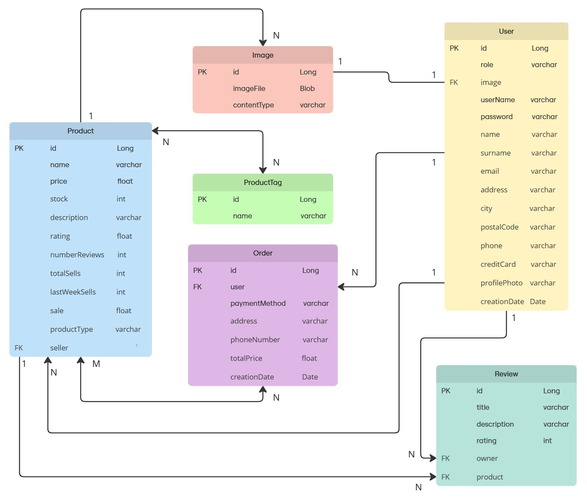
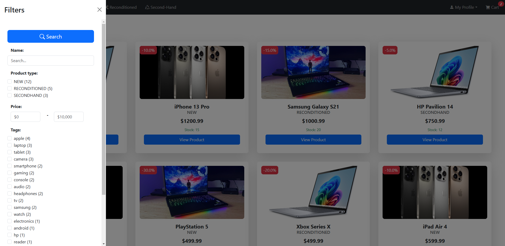

# Swappy  

---
## Team Members
| Name and Surname | Email | GitHub |
|:-----------------|:-----:|-------:|
| **Jaime Ochoa**    | j.ochoa.2022@alumnos.urjc.es | GranLobo2004 |
| **David Pimentel** | d.pimentel.2021@alumnos.urjc.es | daaaviid-03 |
| **Lídia Budiós**   |  l.budios.2024@alumnos.urjc.es | lidiabm |

---
## Functionalities 
Our web application is designed to facilitate buying and selling products, offering an intuitive, modern, and efficient experience for both buyers and sellers. Below are the main features it provides.  

The application allows users to explore a wide variety of products across different categories: new, refurbished, and second-hand. Additionally, a search function and advanced filters are available to refine searches based on user preferences, making it easier to find the ideal product.  

Users can list items on the platform by providing images, name, price, description, stock, discounts, filter tags, and specifying whether the product is new, refurbished, or second-hand. They can also modify the details of the products they have listed for sale.  

A shopping cart feature is available, allowing users to add products to manage their selected items easily or remove them before proceeding to checkout. During the checkout process, the necessary purchase information is requested, and once completed, the user receives a confirmation message ensuring the transaction was successful.  

Each user has a personal profile where they can view and manage their information. From this section, users can edit their profile to update personal details, access the option to sell a new product, or navigate to the privacy section.  

Buyers can rate and leave reviews on products, helping other users make informed decisions. Reviews include a title, a description of the opinion, and a star rating (1 to 5).

---

## Aplication Overview
### Entities 
- **User**: there are three types of user: anonymous, registered and administrator. 
    - The *registered user* can place multiple orders, leave multiple reviews and add products to the cart 
    - The *admin user* can manage the products, the reviews and the orders 
    - The *anonymous user* Anonymous user can only see the products, but has no relation with the other entities
Therefore it is related to the entities: product, review and order.

- **Product**: represents the products available in the application.There are two types of producs: *first-hand* and *second-hand*. Both types of products have images of themselves, can have user reviews, and can be part of orders with the difference that first-hand products can be in multiple orders and second-hand products can only be in one.
Therefore it is related to the entities: user, review and order. 

- **Review**: a review is created by a user and is associated with a product. 
Therefore it is related to the entities: user and product.

- **Order**: an order belongs to a user and is made up of multiple products. 
Therefore it is related to the entities: user and product.

- **Image**: linked to products; each product can have multiple images.
Therefore it is related to the product entity. 

#### Database entity diagram 

### User Permissions 
In this first installment of the practice, the user will always be an administrator and will be able to use all the functionalities of the web application.

### Images 

---
## Navigation 
The web application we have developed is an online buying and selling platform. Users can both list products for sale and purchase new, refurbished, or second-hand items.

Most screens of the application have a main menu at the top of the screen, consisting of six main sections:

**1. Home** 

The web application starts its execution on the main screen, called Home. In this section, featured products are displayed, organized into different categories, such as bestsellers or discounted items, making navigation easier for users and helping them find what they are looking for intuitively.

Additionally, the platform includes a search function that allows users to quickly and efficiently locate specific products.

- **1.1. Product details**

On this screen, the user can view all the details of the product, including: the product name and type, price and any applicable discounts, a detailed description of the item, the average rating and total number of reviews, the available stock quantity, and the number of sales made.

Additionally, from this same section, users can leave comments and ratings on the product, as well as read the opinions and reviews of other buyers.

**2. Search**

On this screen, all types of items will be displayed to the user, who can narrow down their search using various available filters, such as category, price, rating, among others. They will also have the option to perform a direct search by entering keywords, as shown below:

**3. New**

This screen displays all the new products available on the website. Additionally, it features a search function and filters that allow users to easily find the product they want, tailoring the search to their preferences.

**4. Reaconditioned** 

Similar to the previous screen, this one displays all the reaconditioned products available on the website. It also includes filters and a search function so that the user can refine their search and easily find the desired product.

**5. Second-Hand**

This screen is similar to the previous two, but instead of displaying new or reaconditioned products, it shows second-hand products available on the website. As with the previous screens, the user can use filters and a search function to find the specific product they are looking for.

**6. My Profile** 

This button provides access to a dropdown menu that contains several sections related to the user's profile. The available sections are: View Profile, Edit Profile, Sell New Product, and Privacy.

- **6.1. View Profile**

On this screen, the user can view all their personal information, including their full name, username, profile picture, email, location, and mobile number.

Additionally, this section displays the user's comments and ratings, purchase orders, and all the products they have listed for sale.

From this screen, the user can also directly access Edit Profile to update their personal information and Sell New Product to list a new product for sale.

- **6.2. Edit Profile**

On this screen, the user can edit all fields of their personal information, including name, username, last name, email, phone number, address, city, postal code, and payment method. Once the changes are made, they can either save them or cancel the edit if they do not wish to apply the modifications.

- **6.3. Sell New Product**

On this screen, the user can add a new item for sale so that other users can purchase it. To list the product, they must provide the following information: product images, product name, price, detailed description, stock quantity, discount (if applicable), tags to facilitate search through filters, and the product condition: new, second-hand, or reaconditioned.  

Once this information is completed, the user can publish the product on the platform.

- **6.4. Privacy**

This screen explains to the user the terms of the license under which the application is distributed.

**7. Cart**

Finally, we have the cart section, where the user can add products they are interested in or remove those they no longer want. Once they have selected the items, they can proceed to the payment process by clicking the "Checkout" button.

-**7.1. Checkout**

In the Checkout process, the user is asked for the necessary information to complete the purchase, such as the payment method, shipping address, and phone number. 

Once the user makes the payment, they receive a notification confirming that the transaction has been successfully completed, along with the order ID for reference.

 

---
## Team Contributions 
<!-- in the end -->
